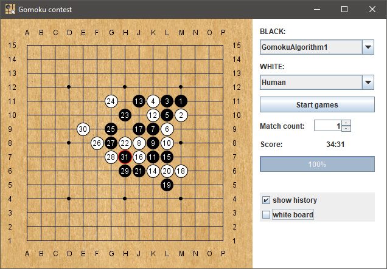

Gomoku contest
======
The program allows you to compete two strategies in the game freestyle gomoku (without restrictions) on the 15x15 board.

You can program your own algorithm and compare it with another.
Examples of the developed engines in the "engine_sample" folder.
Each engine must implement the IGomokuEngine interface, as well as have a description in the xml file.
The created engines are placed in the "engines" folder in the folder with GomokuContest.jar.

